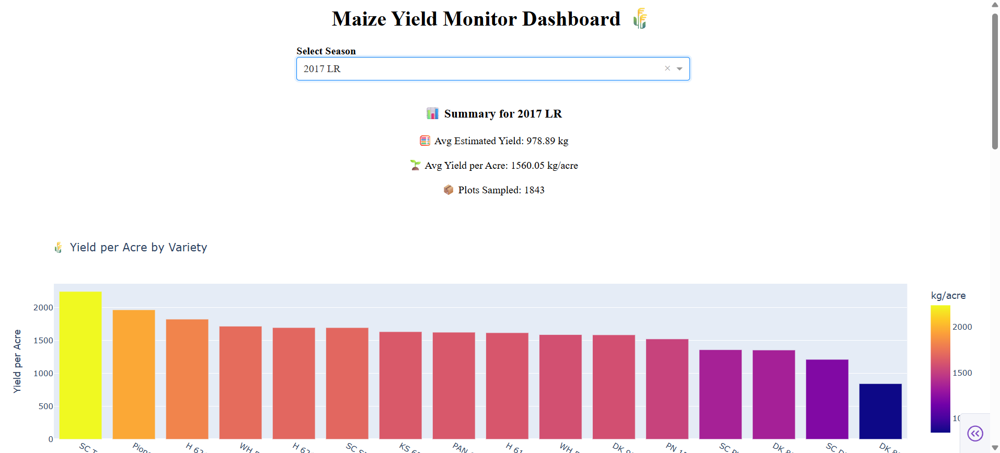

# 🌽 Maize Yield Monitor Dashboard

An agronomic dashboard designed to visualize SOP-calibrated maize yield across East African campaigns using imagery insights, field-level analytics, and seasonal comparisons. Built with Python + Plotly Dash, it empowers agricultural teams to make data-driven decisions rooted in real performance.

---

## 🌍 How This Dashboard Supports the Community

- 🔎 **Early Performance Detection**: Identify underperforming seed varieties across seasons or regions.
- 🧪 **Quality Yield Diagnostics**: Correlate image quality with crop output for smarter data usage.
- 📦 **Outlier Monitoring**: Flag unusually high or low yields for further field review.
- 📈 **Data-Driven Planning**: Track yield improvements, optimize variety selection, and compare countries.
- 📊 **Farmer-Level Insights**: Assess real field samples to inform operational strategy and input distribution.

---

## 🎯 Project Objectives

- Normalize plot-level yield per acre using SOP-calibrated estimates  
- Compare performance across seed varieties and countries  
- Visualize image quality impact on yield outcomes  
- Detect statistical outliers for plot-level auditing  
- Prepare seasonal briefs that inform field strategy

---

## 🛠️ Methodology

- Built with `Dash`, `Pandas`, and `Plotly`
- Inputs a curated `yield_metrics.csv` derived from large-scale agronomic SOP workflows
- Season-based filtering enables targeted insights
- Interactive charts, summary cards, and diagnostic tables built from raw field metrics

---

## 📊 Dashboard Outputs

| Module                        | Description                                |
|------------------------------|--------------------------------------------|
| 🔎 Summary Card              | Avg yield & sample size per season         |
| 🌱 Variety Leaderboard       | Ranked bar chart of yield/acre             |
| 🌍 Country Comparison        | Avg performance across countries           |
| 🎯 Quality vs Yield Scatter | Relates image score to yield metrics       |
| 🧮 Variety Comparison Table  | Avg yield + sample size per variety        |
| ⚠️ Outlier Flag              | Flags plots with yield/acre <300 or >1200  |
| 📥 CSV Export *(upcoming)*   | Filtered downloads by season               |
| 🖼️ Image Preview *(upcoming)*| Tooltip previews by `ImgID`                |

---

## 📁 Folder Structure

MaizeYieldMonitor/
├── app.py
├── data/
│   └── yield_metrics.csv
├── assets/
│   └── preview1.png, preview2.png, yieldmetricscalculations.sql
├── README.md

---
## 📸 Dashboard Previews

### 🎯 Dashboard Overview

### 🌾 Yield Analytics Panel

## 🔍 Summary Panel
Displays average estimated yield, yield per acre, and sample size for selected season.

## 🌱 Leaderboard Visualization
Ranks seed varieties based on yield performance across field samples.

## 🧮 Data Table Insights
Tabulates variety-level averages with sample counts for granular analysis.

---

## Tech Stack Badge Row

